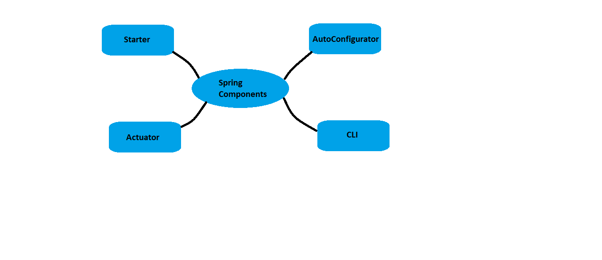

Spring Boot framework is built on top of spring IO in order to have its advantages (try to prove with examples)

1. decreasing developer efforts by avoiding boiler plate code in configuration. It also
2. provides certain defaults necessary for unit and integration testing
3. easy to integrate with Spring JDBC, Spring security etc
4. provide embedded Tomcat server and jetty server
5. provides plugins to develop and test using build tools like Maven and Gradle
6. it provided in memeory databases also
7. It follows “Opinionated Defaults Configuration” Approach to reduce Developer effort where a starter project is given out Using CLI Tool, Springstarter website(https://start.spring.io/) or sts ide
8. Avoid xml completely
   In Springboot we don’t have to write XML Configuration and only few Annotations should do the magic….that weas a relief for me
   Springboot is said to be inspired by Groovy Programming model, it is said it used groovy based techniques to provide default imports and configuration.
   Key Components of Spring Boot:
9. Spring Boot starter:
   • This handles to combine common and related jars into a single dependency.
   • For instance, to create a web application we can include the spring-boot-starter-web dependency and this will pack together spring-boot starter(spring-boot, spring-boot-autoconfigure, spring-boot-starter-logging), spring-web, spring-web mvc and spring-boot-starter-tomcat(Tomcat-embed-core, Tomcat-embed-logging).
   • This feature is applicable for other application you might want to apply and would have to include 3-4 dependency in case of Spring.
   • This simplifies the process and definition of project build dependencies
10. Spring Boot Auto Configurator:
    • Spring had this downside where developers were forced to make hectic configurations XML or Annotation based
    • Spring boot hence is capable of letting the developer create a web application with zero xml configurations and minimal or no annotation configurations
    • Auto Configurator will take care to include the configuration information the application needs hence resucing the configuration details needed
    • If we use spring-boot-starter-web jar file to our project build file Auto Configurator will resolve views, view resolvers etc automatically
    • Declaring at class level @SpringBootApplication will make Spring Boot Auto Configurator add required annotations (@Configuration, @ComponentScan, EnableAutoConfiguration) to Java Class Bytecode.
    • Spring Starter triggers the Spring Boot Auto Configurator
11. Spring Boot CLI
    • Spring Boot CLI (Command Line Interface) lets us run and test Spring Boot application in the command prompt
    • When we run using CLI it would internally use Spring Boot starter and Auto Configurator.
12. Spring Boot Actuator
    • Provides management EndpointsProvides application metrics

Spring Boot Rest Services:
@RestController: annotating controller class with this annotation notifies spring boot to scan this class to find rest endpoints that need to be configured
RequestMapping: this is the method which handles the client requests. This could be configured to be HTTP method supported or the request response content type can be specified. By default Get methos is supported with json content type responses returned.

Spring Boot Actuator
Spring Boot Actuator provides the medium to monitor and interact with the application by reflecting information via various endpoints. These built in endpoints lets us enable or disable them in our application.
To configure actuators in spring boot we can add spring boot actuator dependency few endpoints might need spring security dependency too.
Chance default endpoint base adding this in properperties file : management.endpoints.web.base-path=/management
##Known actuator endpoints:

> bean: lists all the beans configured in the application (http://localhost:8080/management/beans)
> env: provides information on the spring environment( http://localhost:8080/management/env)
> health: shows the application health (http://localhost:8080/actuator/health)
> info: displays application information and this can be configured using spring properties. If not configure by default it would be blank (http://localhost:8080/actuator/info)
> mapping: list of @RequestMapping paths (http://localhost:8080/management/mappings)
> shutdown: allows to shutdown the application
> threaddump: provides the thread dump with respect to application (http://localhost:8080/management/threaddump)

_all available actuator endpoints: https://docs.spring.io/spring-boot/docs/current/reference/html/production-ready-features.html#production-ready-endpoints_

We can create custom actuator endpoints using @Endpoint annotation on a class. Annotation to decide how to expose your custom endpoints are @ReadOperation, @WriteOperation and @DeleteOperation.

```java
@Endpoint(id="endpoint1")
@Component
public class CustomAnnotation {

	@ReadOperation
	@Bean
	public String custome() {
		return "Customs:{actuator endpoint}";
	}
}
```
