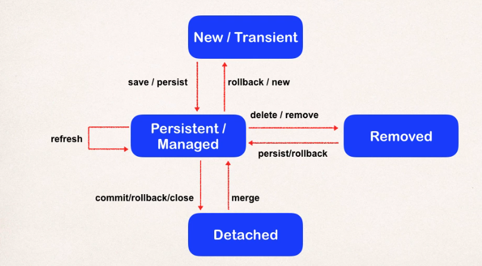
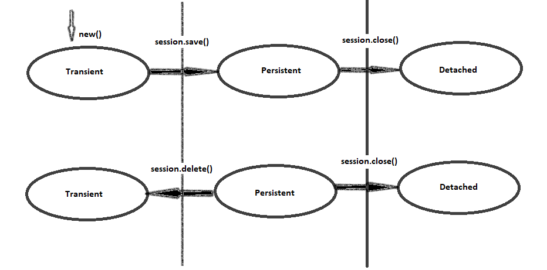

Need for hibernate: the object relation impedendence problem: a bridge between how object and databse values are stored.
and the normalization

JDBC: lot of boilerplate
Spring JDBC: a layer was provided ad gave a template for mapping and retrieval.

Let’s see how and where Hibernate came from first
• An ORM tool
• Implements JPA
• Used in data layer application

_Hibernate makes use of jdbc in background for low level sql queries and is an abstarction on top of jdbc_

Difference between jdbc and hibernate:
JDBC Saving:
• JDBC Database Configuration
• Create Model Object
• Service method to create/instantiate model object
• Database design
• DAO method to save the object using SQL queries
Hibernate Saving:
• Hibernate Configuration
• Create Model Object using Annotation
• Service calls hibernate API to instantiate object
• Database design is not needed
• DAO method to save the object using SQL queries is not needed

Hibernate configuration file: hibernate.cfg.xml copy from other internet files and modify the configuration in your system based on your needs. Some configurations:

```xml
<?xml version="1.0" encoding="UTF-8"?>

<!-- define software setting for hibernate to translate database specific statements-->
<property name="dialect">org.hibernate.dialect.MySQLDialect</property>
<property name="dialect">org.hibernate.dialect.PostgreSQL</property>

<!-- Mapping details of DTO/ Object/ Model level class should be mentioned in configuration files-->
<mapping class="org.dto.UserDetails"/>

<!-- Drop and recreate the db schema on every startup-->
 <property name="hbm2ddl.auto">create</property>
<!-- update in case of changes in the database only and do not new create a db-->
 <property name="hbm2ddl.auto">update</property>
<!-- to echo and show all sql commands on execution-->
 <property name="show_sql">true</property>
```

@Entity to define a Table as the entity class and @id is the primary key

```java
@Entity(name="User_Details")
public class UserDetails {

	@Id
	@Column(name="user_id")
	private int userid;
	@Column(name="user_name")
	private String username;
	public int getUserid() {
		return userid;
	}
	public void setUserid(int userid) {
		this.userid = userid;
	}
	public String getUsername() {
		return username;
	}
	public void setUsername(String username) {
		this.username = username;
	}

}
```

Create session factory and session object

```java
UserDetails user=new UserDetails();
user.setUserid(1);
user.setUsername("abc");

SessionFactory sessionFactory=new Configuration().configure().buildsessionFactory();
/*get SessionFactory by reading the configuration file-->one can mention path
*inside configure if it is specific other than deafult hibernate.cfg.xml
*build the session factory and store that in the local sessionFactory object
*/
Session session=sessionFactory.openSession();
//open or get session from the sessionFactory
session.beginTransaction();
//transactions is necessary to be started with any transactions
session.save(user);
//save the user object inside the database
session.getTransaction().commit();
//to end the transactions it has to be commited to end and reflect changes
```

Some more annotations:
@Table: When the requirement is to change only the db table name and keep the class name/entity name as mentioned in class level. UserDetails will remain the entity name and table name in the database would be User_Details.

```java
@Entity
@Table(name="User_Details")
public class UserDetails {
```

There could be requirements where we might need some values to not be saved in the database. It could be counter you need to track some value or some url / value you need user to view but not the database to store(Note transient ijn serialization means the value is not to be serialized an object can be transient as in not stored In db still serialized so keep in mind the transient for serialization and @Transient is different). Such values or attributes have to be marked as a

```java
@Transient //do not store in database
@Temporal(TemporalType.DATE) //@Temporal(TemporalType.TIME) //To save the date/ time specifically
@Lob @Clob @Blob //attributes which would store very large text sizes/character size/ byte size
```

Fetching an object in Hibernate

```java
SessionFactory sessionFactory=new Configuration().configure().buildsessionFactory();
Session session=sessionFactory.openSession();
session.beginTransaction();
UserDetails user=(UserDetails)session.get(UserDetails.class,1);
//session.get(classtype to indicate which kind of object has to be retrieved,primary id based on which the object has to be fetched)
```

Surrogate Primary Keys: The primary keys that are not needed/ generated in business terms or the once that do not have a business related meaning and meant only to keep track of the uniqueness of the attributes can be actually asked to be generated by hibernate rather that assigning them.

```java
@GeneratedValue(strategy=GenerationType.AUTO)
private id;
//GenerationType is an Enum with values AUTO,IDENTITY,SEQUENCE,TABLE:AUTO lets hibernate chose the way to generate the unique values
```

**_Value Types and Embedded Objects_**
There are certain attributes with respect to a Entity which are deeply associated with it and is incomplete in meaning by itself like address to USerDetails Table such entities are to be defined as @Embeddable and declared as @Embedded attributes.

```java
@Embeddable
public class Address{
	/*attributes and method*/
}

@Entity(name="User_Details")
public class UserDetails {
	@Embedded
	private Address address;
	/*other attributes and method*/
}
```

Say we need to store multiple addresses like permenant, official addresses etc:
We might have to differentiate each of them by annotating as below :
@Embedded
@AttributeOverrides({@AttributeOverride(name=””,column=@Column(name=”HOME”)})
private Address address;
OR
@Embedded
@ElementCollection
@JoinTable(name=””,joinColumns=@joinColumn())
private Set<Address> addresses=new HashSet<>();

,.,.,.,.,.,.???????????????//check more on this/?????????………………………………………………………….
if primary key is embedded mention it as @EmbeddedId
and joining and mui

**_Lazy Initialization and Early Initialization_**
Lazy Initilization is a strategy where when an object is initialized only the first level members are initlize, the associated objects are initialized only when they are explicitly accesed (like address in above example) that means when in need.This is used by default in hibernate and saves a lot of time and resources.
Eager Intialization is the opposite here the all objects and associated objects are initilaised at once.
When in need Hibernate can be oved from its default behariour to be eager by making fetch=FetchType.EAGER.
Hibernate when it runs, when accessing an object creates a proxy object( that is a subclass of the real object hence having the same behavior)it tries to access and it operates on top of this proxy and does the operation.
**_DataBase entries during Association types( OnetoOne Manytomany onetomany and vice versa)_**
@OnetoOne

1. create first table
2. create second table
3. update forign key to relate in table
   @OnetoMany or @ManytoOne
4. create first table
5. create second table
6. create new table and insert relationship between first and second table
   @ManytoMany
7. create first table
8. create second table
9. create new table and insert relationship between first and second table
10. create another relationship table for relationship between first and second
    to avoid to relationship table mention in one entity attributes that the associated object is the same as mentioned in other place as in @ManytoMany(mappedBy=”address”)

\*\*To avoid hibernate to throw exception when a data is not found add an annotation above required attribute as:

```java
@NotFound(action=NotFoundAction.IGNORE)
```

 Cascade is used to persist objects in case of one to many relationships. Let’s unsaved objects to be saved on save of one object

```java
@OnetoMany(cascade=CascadeType.PERSIST)
```

\*\*Inheritance in hibernate has to be handled in different ways
Every class is saved in a single table increasing the table column wise

```java
@Inheritance(strategy=InheritanceType.SINGLETABLE)
```

Every class has a separate table but there could be repeated values in tables and hence redundancy

```java
@Inheritance(strategy=InheritanceType.TABLE_PER_CLASS)
```

We avoid redundant values and repeated coulmns to give a joined normalized Table

```java
@Inheritance(strategy=InheritanceType.JOINED)
```

**_Hibernate Collections_**
Bag Semantic: List/ArrayList unordered
Bag Semantic with ID: List/ArrayList unordered
List Semantic: List/ArrayList ordered
Set Semantic: Set
Map Semantic: Map

**_Crud in hibernate_**
Create:

```java
for(int i=0;i<5;i++){
	UserDetails user=new UserDetails();
	user.setUsername("User"+i)
	session.save(user) //creating user created above
}
```

Retrieve:

```java
UserDetails user=(UserDetails)session.get(UserDetails.class,6);
```

Update:

```java
UserDetails user=(UserDetails)session.get(UserDetails.class,6);
user.setUsername("update username");
session.update(user);
```

Delete:

```java
UserDetails user=(UserDetails)session.get(UserDetails.class,6);
session.delete(user);
```

##Entity Lifecycle


> Detached: Entity is not associated with a hibernate session

> Merge: Entity once detached from session, then can merge it to reattach it to the session

> Persist: Transitions a new instance to a managed state of hibernate. One the next flush/commit it will be saved in DB

> Remove: Takes a manged entity and removes it. On next flush/commit it will be deleted from the DB

> Refresh: Allows you to reload/sync object from the db. Prevents having stale data that is different from the DB.

**_Transient, Persistent and Detached object_**



```java
UserDetails user1=new UserDetails(); //transient: these changes are not reflected in the database since it goes unnoyiced by Hibernate
user1.setUsername("User_1"); //transient
SessionFactory sessionFactory=new Configuration().configure().buildsessionFactory();
Session session=sessionFactory.openSession();
session.beginTransaction();
session.save(user1);//on save of session the objects go to persistent state changes done after this are recognized and reflected
user1.setUsername("User_001"); //persistent
user1.setUsername("User_01"); //persistent //all updates are checked and hibernate smartly considers only the last update done to be taken to the database
session.getTransaction().commit();
session.close();
user1.setUsername("User_1");//detached the changes are not tracked here in detached state so changes have no effect
```

```java
SessionFactory sessionFactory=new Configuration().configure().buildsessionFactory();
Session session=sessionFactory.openSession();
session.beginTransaction();
session.save(user1);
user1.setUsername("User_001"); //persistent
user1.setUsername("User_01"); //persistent
session.getTransaction().commit();
session.close();
user1.setUsername("User_1");//detached
session.beginTransaction();//start the same session
session.update(user);//persistent :hence update after change from persistent to detached form
session.close();
```

**_Hibernate Query Language_**
In Hibernate Queries are written using HQL (Hibernate Query Language). Here all representations happen in the form of objects and classes and attributes of these classes instead of columns. One does not have to check for table names or column names instead can use the entity details for operations with the database.
In hibernate:

1. Create a Query Object
2. Use this query object for retrieving the result

```java
SessionFactory sessionFactory=new Configuration().configure().buildsessionFactory();
Session session=sessionFactory.openSession();
session.beginTransaction();
Query query=session.createQuery("from UserDetails where userid>5");
List<UserDetails> users=query.list();
Query query=session.createQuery("select username from UserDetails");
List<String> usernames=query.list();
Query query=session.createQuery("select new map(userid,username) from UserDetails");
//Map<Integer,String> usermap=query.
Query query=session.createQuery("select max(userid) from UserDetails");
//int max=query.
session.getTransaction().commit();
session.close();
```

Instead of getting large results at once, developers can use pagination techniques to limit the results retrieved.

**_Criteria API_**
Access by criteria API

```java
SessionFactory sessionFactory=new Configuration().configure().buildsessionFactory();
Session session=sessionFactory.openSession();
session.beginTransaction();
Criteria criteria=session.createCriteria(UserDetails.class);
criteria.add(Restrictions.eq("sername","User_10).gt("userid",5));// add all restrictions or filters like you would in where clause
List<UserDetails> users=(List<UserDetails>)criteria.list();
session.getTransaction().commit();
session.close();
```

**_Hibernate Cache_**

First level cache provided by session in hibernate
Second level is developer define using @Cache, @Cacheable

**_Combining of Hibernate with Spring_**
• Use Hibernate Template
• Easy to test and better exception Handling
• Integrated Transaction Management
• Dao class depends on Hibernate Template
• Hibernate Template was created by SessionFactory ( LocalSessionFactoryBean)
• LocalSessionFactoryBean takes Annotatedclass, Hibernate Properties and DataSource

```java
public class SampleDAO {

	@Autowire
	private HibernateTemplate hibernateTemplate;

	@Transactional
	public int insert(Sample sample) {
		Integer i=(Integer)this.hibernateTemplate.save(sample);
		return i;
	}
//more operations with db

@Transactional(noRollbackFor={Exception.class})

@Transactional(rollbackFor={Exception.class})

@Transactional(timeout=1)
//specify the timeout when db update should happen within

}
```

##Hibernate Development Process

> add hibernate configuration file

> annotate the class- map class to db table and map fields to database column

> develop java code to do database operation

Entity class: POJO that is mapped to database

```java
@Entity(name="Student")
public class Student {

	@Id
	@Column(name="id")
	private int studentid;
	@Column(name="user_name")
	private String username;
	public int getStudentid() {
		return studentid;
	}
	public void setStudentid(int studentid) {
		this.userid = studentid;
	}
	public String getUsername() {
		return username;
	}
	public void setUsername(String username) {
		this.username = username;
	}

}
```

_Session is used to get physical connection with the Database.Session object is lightweight, short lived and is designed to be instantiated when there is database interaction necessary. Used to save and retrieve persistent objects. It wraps the JDBC COnnection. Its a retrieved from SessionObject._

_Session Factory is a heavy weight object which is created only once(its later used) that reads the Hibernate config file, creates session objects_

**Create**

```java
SessionFactory sessionFactory=new Configuration().configure("hibernate.cfg.xml").addAnnotatedClass(Student.class).buildsessionFactory();
Session session=sessionFactory.getCurrentSession();
try{
	//use session object to save/retrieve Java objects
	//create student
	Student temp_student=new Student("Rodeger","Filch","rofil@keen.com");
	//start the transaction
	session.begintransaction();
	//save the student
	session.save(temp_student);
	//read from database providing a primary key
	Student myStudent=session.get(Student.class,6);
	//commit the transaction
	session.getTransaction.commit();
}finally{
	factory.close();
}
```

_Hibernate behind the scenes takes care of database connection from configuration file details and also figures out how Student has to be stored in the database_

##Custom primary key generation strategy in Hibernate

> Create subclass of org.hibernate.id.SequenceGenerator/IdentifierGenerator

> Override method: public Serializable generate()

> just make sure the generator strategy should work and produce unique values even in high volumes of data or multithreaded environment

```java
@Entity
public class Department {

@Id
@GenericGenerator(name = "sequence_dep_id", strategy = "com.xyz.ids.DepartmentIdGenerator")
@GeneratedValue(generator = "sequence_dep_id")
@Column(name="Department_Id")
private String deptId;

@Column(name="Department_Name",unique=true,nullable=false)
private String deptName;


@Column(name="Department_Description")
@NotNull
private String deptDesc;

//getters and setters
```

```java
public class DepartmentIdGenerator implements IdentifierGenerator{

    @Override
    public Serializable generate(SessionImplementor session, Object object)
            throws HibernateException {

        String prefix = "DEP";
        Connection connection = session.connection();

        try {
            Statement statement=connection.createStatement();

            ResultSet rs=statement.executeQuery("select count(Department_Id) as Id from demo.Department");

            if(rs.next())
            {
                int id=rs.getInt(1)+101;
                String generatedId = prefix + new Integer(id).toString();
                System.out.println("Generated Id: " + generatedId);
                return generatedId;
            }
        } catch (SQLException e) {
            // TODO Auto-generated catch block
            e.printStackTrace();
        }


        return null;
    }

}
```

##Hibernate Query Language

> Retrieve all students : Select \* from Student; List<Student> students=session.createQuery("from Student").getResultList();

> Retrive students witn last name Potter: Select \* from Student where lastname='Potter';List<Student> potters= session.createQuery("from Student where lastname='Potter'").getResultList();

> Use Or predicate: List<Student> potters= session.createQuery("from Student where lastname='Potter' OR lastname='Riddle'").getResultList();

> Like predicate: List<Student> students=session.createQuery("from Student where email LIKE '%hogwarts.com'").getResultList()

**Read/Retrieve**

```java
SessionFactory sessionFactory=new Configuration().configure("hibernate.cfg.xml").addAnnotatedClass(Student.class).buildsessionFactory();
Session session=sessionFactory.getCurrentSession();
try{
	//start the transaction
	session.begintransaction();
	//read from database providing a primary key
	Student myStudent=session.get(Student.class,6);
	//commit the transaction
	session.getTransaction.commit();
}finally{
	factory.close();
}
```

**Update**

```java
SessionFactory factory=new COnfiguration().configure("hibenrate.cfg.xml").addAnnotatedClass(Student.class).buildSessionFactory();
Session session=factory.getCurrentSession();
try{
	//begin transaction
	session.beginTransaction();
	//get the object based on primary key you need to update
	Student student_modification=session.get(Student.class,6);
	//use setters to update values
	student_modification.setLastName("Malfoy");
	//commit the transaction
	session.getTransaction.commit();
}finally{
	factory.close();
}
```

say you update all the students may be using hql

```java
session.createQuery("update Student set email='umbridge@hogwarts.com'").executeUpdate();
```

**Delete**

```java
SessionFactory factory=new COnfiguration().configure("hibenrate.cfg.xml").addAnnotatedClass(Student.class).buildSessionFactory();
Session session=factory.getCurrentSession();
try{
	//begin transaction
	session.beginTransaction();
	//get the object based on primary key you need to delete
	Student student_remove=session.get(Student.class,6);
	//delete the object
	session.delete(student_remove);
	//commit the transaction
	session.getTransaction.commit();
}finally{
	factory.close();
}
```

or with hql without retrieving but with a single line(_point of HQL is conciseness_)

```java
session.createQuery("delete from Student where id=2").executeUpdate();
```

##Advanced mapping

> one to one: One profile for one professor

> one to many/ many to one: One instructor teaching many courses and inverse

> many to many: many students take many students

_Cascade is the method where 2 related tables with a foreign key should do operations in both the tables. eg: We have a table employee and employee details table when an employee is deleted from employee table the details are normally deleted from the employee details table too_

**One to One Mapping:Unidirectional**

```java
@Entity
@Table(name="instructor_detail")
public class InstructorDetail {

	@Id
	@GeneratedValue(strategy=GenerationType.IDENTITY)
	@Column(name="id")
	private int id;
	@Column(name="youtube_channel")
	private String youtubeChannel;
	@Column(name="hobby")
	private String Hobby;

	//getters and setters
}
```

```java
@Entity
@Table(name="instructor")
public class Instructor {

	@Id
	@GeneratedValue(strategy=GenerationType.IDENTITY)
	@Column(name="id")
	private int id;
	@OnetoOne
	@JoinColumn(name="instructor_detail")
	private int instructordetail;
	@Column(name="first_name")
	private String firstname;
	@Column(name="last_name")
	private String lastname;
	@Column(name="email")
	private String email;
	//getters and setters
}
```

@OnetoOne
@JoinColumn(name="instructor_detail")
These are used to hookup the instructordetails to instructor table and then hibernated manages the mapping accordingly using foreign key using the reference of joinColumn

Configure Cascade Type: @OnetoOne(cascade=CascadeType.ALL)
_By Default no operations are cascaded_

```java
@OnetoOne(cascade={CasacadeType.PERSIST,CasacadeType.MERGE})
@JoinColumn(name="instructor_detail")
private int instructordetail;
```

onetoopnedelet entity--video pause
**One to One Mapping:Bidirectional**
**One to Many Mapping:Unidirectional**
**One to Many Mapping:Bidirectional**
**Many to Many Mapping:Unidirectional**
**Many to Many Mapping:Bidirectional**
