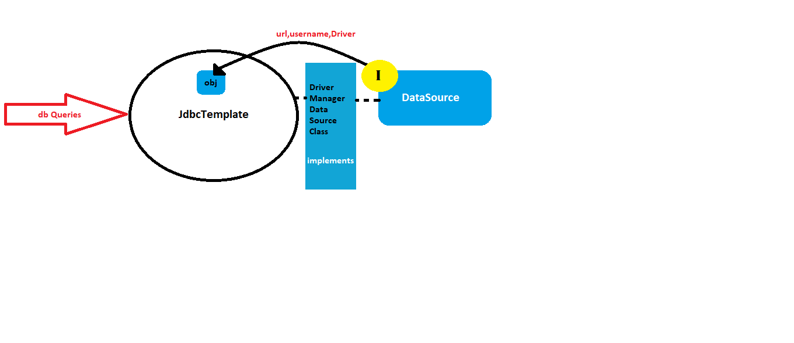

Spring JDBC
 Spring Jdbc is a mechanism to connect to database and execute queries using spring jdbc modules.
Spring jdbc module:
•	JdbcTemplate: this consists of methods which consists of various database operations that a developer might need to use. Handles closing and opening connections

•	Datasource: this is an interface that provides information regarding the database to Jdbctemplate like url, username, driver etc(classes that implement DriverManagerDataSource )

Query methods:
•	Execute: select
•	Execute update: insert, update, delete
Add dependencies in pom file:
```xml
<!-- https://mvnrepository.com/artifact/org.springframework/spring-jdbc -->
<dependency>
    <groupId>org.springframework</groupId>
    <artifactId>spring-jdbc</artifactId>
    <version>5.3.0</version>
</dependency>

<!-- https://mvnrepository.com/artifact/mysql/mysql-connector-java -->
<dependency>
    <groupId>mysql</groupId>
    <artifactId>mysql-connector-java</artifactId>
    <version>8.0.15</version>
</dependency>
```
Note :Change dependencies based on your configuration needs

Selecting data using Spring JDBC:
```java
public T queryForObject(String sql, RowMapper<T> rowMapper, Object args)
public List<T> query(String sql, RowMapper<T> rowMapper)
```
RowMapper is an Interface that lets you converts resultset to object of entity form ( no need of a resultSet) and create a user implementation using maprow() method

Include jdbc template and DAO classes either by Autoriiring or xml file:
If one uses xml files mention property > with ref attribute in config.xml  the other autoring has to be done in create a config class with @configuration asnd @bean and return driverMangareDataSOurce type,  and set drivercclassname url password etc, Bean for JdbcTemplate to get template object
To summarize in xml configure by <bean> and set by <property> and ref attritube and name for values and for annotation use @bean with respective setters 
I personally recommend using annotation because I feel they are easier and more usr dev friendly (this is just my opinion) 
correctrtion autoriwing can be done with @Component and @Autowired andf annotation based with config class for tAutowiring use or mention @ComponentScan for reference in autowiring

Note: DOA classes also needs to be configured in config files(class or xml)

{
WHEN CREATING H2 DATABASE CREATE SCHEMA.SQL FOR CREATION AND DATA.SQL FOR UPDATION ALSO MENTION APPLICATION.PROPERTIES FILE
#enable h2 console
spring.h2.console.enabled=true
#mention the paltform you are working with
spring.datasource.platform=h2
#specify the url
spring.datasource.url=jdbc:h2:mem:candystore
}


