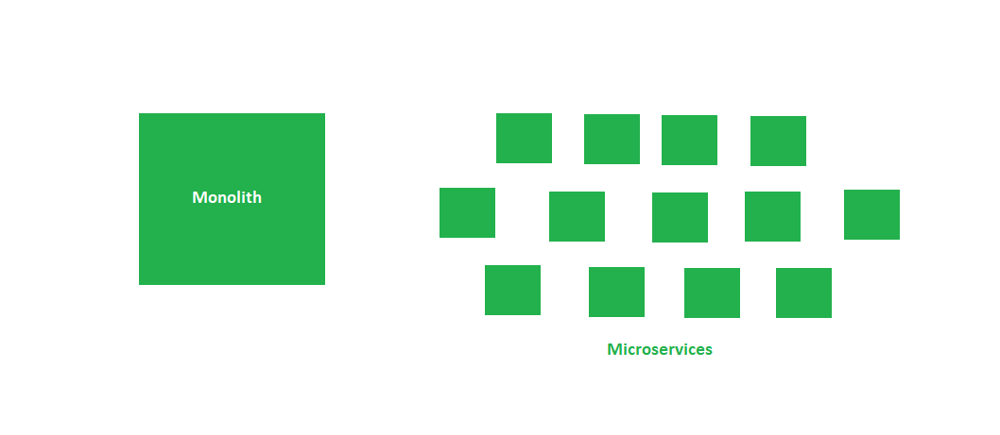

Monolithic arch disadvantages:
*Deployment is challenging eventually
*Testing the whole application is important for a new feature
\*Scaling monolithic applications are more complex

1. Difficult to deploy big applications
2. Scalability is an issue when there is fluctuating traffic on different features.

So instead break a single smudged monolith to many mini applications and make them communicate over a network.

These mini applications are called microservices.
These microservices are a way of breaking the applications or services down into independent stand alone applications that can be run on diff harwarw or server instances. They communicate with each other over rest apis and work together on the application.
We have separation of concerned on deployment too. Work together during runtime to form a one whole application.
Smaller pieces on deployment, smaller chunks and is not an application by itself but combine together with other microservices to form an application.

Advantages:
1.Deployment flexibility
2.technology flexibility

3. Can be scaled separately
4. Effected area during change is smaller

Disadvantages

1. Architectural complexity: seperate services well
2. Service discovery on how to find these microservices
3. Service monitoring is complex . Overall application is complex

————————————————————————-

Spring cloud: a set of libraries or technology that allow you to manage and build microservices in on the cloud which is under the spring cloud.

Restful: way to build your apis that follows rest specs:

1. Treating an individual resource and having an endpoint that maps to a resource
   2.having certain verbs in terms of how you operate on that resource (get post verbs)
2. How uri formed, and how resources are formed etc ( understand )

Why container is used in microservices?
Since deployment is needed more and has to be scaled up and down. If one uses container like docker u break it into docker image. Just deploy and all things needed for image comes with it instead of multiple deployments.
Use of docker: have an image which can be safely deployed

CDC: client /consumer driven contract : a client comes up with the contract for the microservices.

A microservice is different from webservice in terms of its intent or the motive why it is created. A web service is generally created to be reused and not specific to an application its like a utility used thorught out applications where the standards and contracts had to be more complex.
Microservice is services broken down within an application which might not be resued in other applications. It could be resued later but its generally not created with that intend though.

https://github.com/chaitrarai00/Springmicroservice

Create 3 SpringBoot Project
Build movie catalog api
Build movie info service api
build rating service api
have movie cataloge call the other 2 services the naïve way
have services communicate in a better way

We need to make rest API calls programmatically using Rest client library  Now Springboot comes with a RestClient in its classpath called RestTemplate.

Service Discovery
• start up eureka server
• have microservices register or publish using eureka client
• have microservices locate or consume using eureka client

**_You create Eureka server by a springboot app by adding Eureka Server dependency_**
• Add @EnableEurekaServer annotation
• Application pom if or server and client
**_You create Eureka client by a springboot app by adding Eureka Discovery dependency_**
• Add @EnableEurekaServer annotation
• Application pom if or server and client
• App spring.application.name in the application properties to register in eureka
Fault tolerance: Circuit breaker use hystrix by Netflix
• Add spring-cloud-hystrix-rest-producer dependency in pom
• Add @EnableCircuitbreaker annotation on top of main method
• Add @HystrixCommand(fallbackmethod=”methodnamewithlogic”)
