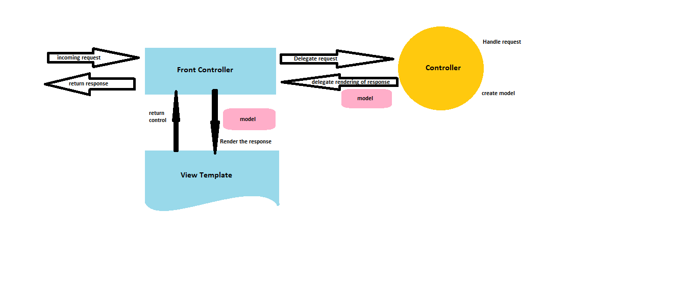
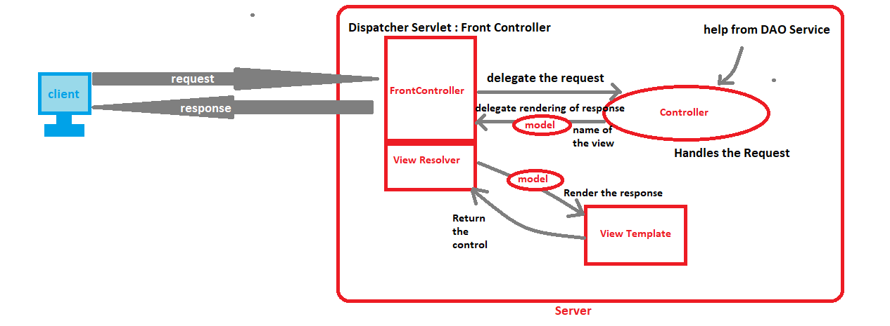

Built on top of Servlet API with all Spring Core features is a sub framework of Spring used to build web applications. Spring MVC works implementing Model-view-controller design pattern.
##Advantages:

> separate roles Model, View and controller
> configuration using spring is easier and powerful
> springs way for building web applications
> once configuration is done application development is fast
> easy to test and flexible
> process form data and help manage application states for web requests


##Internally

> Dispatcher Servlet is given by Spring Dev Team
> Developer has to create model, Controller(Handle request and based on that place data in model or retrieve or store data) and View
> View Template could be JSP, JSTL or ThymeLeaf, Velocity etc

InternalResourceViewResolver is used to mention the location of view pages and suffix used. The controller class returns the name of the view page and the respective location and suffix is picked from here.

<annotation-driven />Tells Dispatcher servlet to look for controllers using annotations.

<context:component-scan base-package="com.spring" />Tells dispatcher servlet where to look for controllers

```xml
<init-param>
      <param-name>contextConfigLocation</param-name>
      <param-value>/WEB-INF/spring-servlet.xml</param-value>
</init-param>
```

##Spring MVC app steps:

> Configure Dispatcher Servlet
> Set up url mapping to Spring MVC Dispatcher Servlet
> Add support to component scanning
> add support for conversion, formatting and validation
> Define Spring MVC view resolver(how do we display the webpages or where are the pages located)
> create controller class
> define controller method
> add request mapping to controller method
> return view name
> develop view page

**Configure Spring Dispatcher Servlet**

web.xml:

```xml
<servlet>
      <servlet-name>mydispacter</param-name>
      <servlet-class>org.springframework.web.servlet.DispatcherServlet
</servlet-class>
<!--give location of configuartion-->
<init-param>
      <param-name>contextConfiguration</param-name>
      <param-value>/WEB-INF/demo-servlet.xml</param-value>
</init-param>
<load-on-startup>1</load-on-startup>
</servlet>
```

**Set up url mapping to Spring MVC Dispatcher**
web.xml:

```xml
<servlet>
      <servlet-name>mydispatcher</servlet-name>
      <servlet-class>org.springframework.web.servlet.DispatcherServlet</servlet-class>
</servlet>

<servlet-mapping>
      <servlet-name>mydispatcher</servlet-name>
      <url-pattern>/</url-pattern>
</servlet-mapping>
<!--any url or request coming in send it to the dispatcher-->
```

**Support for component-scanning, conversion, formatting, validation and defining the spring mvc view resolver**
servlet.xml

```xml
<beans>
      <!--component scan-->
      <context:component-scan base-package="com.example.springdemo"/>
      <!--conversion, formatting and validation-->
      <mvc:annotation-driver/>
      <!--view resolver-->
      <bean
      class="org.springframework.web.servlet.view.InternalResourceViewResolver">
      <property name="prefix" value="/WEB-INF/view"/>
      <propertyname="suffix" value=".jsp"/>
      </bean>
</beans>
```

**Create Controller class-> define controller method->Add request mapping to controller method->return view name from method->develop view page**

```java
@Controller
public class HomeController{
//@RequestMapping shows the url from where the request is to be handled by this method
      @RequestMapping("/show")
      public String showMyPage(){
            return "main menu";
            //menu menu is a simple jsp page
      }
      @RequestMapping("/process")
      public String processMyPage(){
            return "main menu";
            //menu menu is a simple jsp page
      }
}
```

##Read form Data using Spring MVC

> Create Controller class
> Show HTML Form: Create controller method to show HTML form, Create view page for HTML form
> Process HTML Form: Create controller method to process the form, Create view page for confirmation

showpage.jsp

```jsp
<form action="processForm" method="GET">
      <input type="text" name="studentname" placeholder="you name?"/>
      <input type="submit"/>
</form>
```

```java
@Controller
public class HomeController{
 @RequestMapping("/show")
      public String showMyPage(){
            return "formspage";
            //menu menu is a simple jsp page
      }
      @RequestMapping("/processForm")
      public String processForm(){
            return "main menu";
//access in jsp ${param.studentname}
      }
}
```
