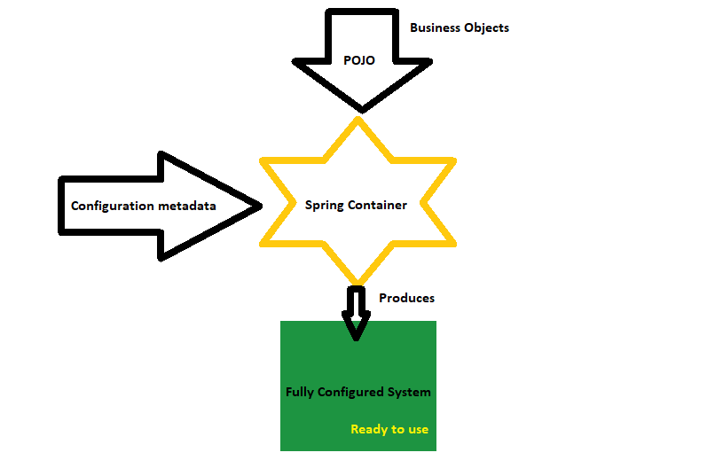
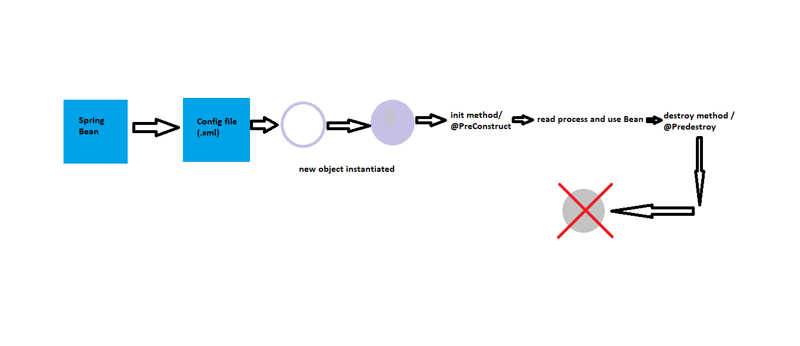

Spring Framework is one of the most popular frameworks of Java Enterprise Edition. Developed by Rod Johnson, java developers prefer Spring to develop efficient applications.(one line intro)

Spring container (represented by org.springframework.context.ApplicationContext) is said to be the core/ heart of the spring framework. The container creates the objects, wires them together, configure them and manage their complete life cycle.
The containers get information on what to instantiate, assemble and configure from reading configuration metadata (represented in the form of XML: xml based, annotations: annotation-based or java code: java-based)
Spring Container is the star all-rounder managing to give to readymade objects to work on your application.


Inversion of control(Outsourcing creation of Objects) is achieved by dependency injection:
It’s a process by which objects define their dependencies (other objects they work with) through constructor arguments (constructor injection) or Properties set to objects (setter injection) after they are constructed or returned from a factory method. The spring container the injects those dependencies when it creates the bean.

In spring the object one wants to inject or use can be just done by using a congif file or annotations(Say you sue interfaces you will have to create a child instance from the parent interface even if its generalised like

```java
Parent p=new child();
//child is hardcoded and has to be changed when new child types are introduced
```

and this was addressed by spring's inversion of control by offering object factory)

Beans are objects that are instantiated, assembled and managed by containers and is an important part of any application. @bean produces a bean to be managed by spring container.

@Component: indicates a component. Such classes are considered as candidates for auto-detection when we use annotation based configuration and class path scanning.

##Configuration of Spring Container

> XML Configuration file
> Java Annotations
> Java Source Code

Configuration metadata represents how a developer instructs the Spring Container to instantiate, configure and assemble the objects in the application.( XML configuration based, annotation based , java source code based )

XML based configured as <bean/> and <beans/>, Import from other file using < import resource=“”/>, Instantiating a container: applicationcontext context = new application context(config.XML /class)

Spring Core:
1.Inversion of control? Instead of objects created and the launching the application and application calls objects/objects are created on basis of application needs

6. Make sure to close an AnnotationConfigApplicationContext To release all resources

Spring Ioc container (part of org.springframework.context and org.springframework.beans) is said to be the core/ heart of the spring framework. The container creates the objects, wire them together “, configure them and manage their complete life cycle.containers get information on what to instantiate , assemble and configure from reading configuration metadata( represented in the form of XML, annotations or java code).
• Bean Factory is the root interface of Spring Ioc Container and child Application context is the child interface.
• Useful child interfaces of ApplicationContext: ConfigurableApplicationContext and WebApplicationContext
•
( make a tabular representation or a venn diagram kind of thing----we use AnnoationConfigApplicationContext for standalonejava applications with
annotation based configuartions and ClassPathXmlApplicationContext, when configuration is loaded from another file system use FileSystemXmlApplicationContext and for web applications: AnnotationconfigWebApplicationContext and XmlWebApplicationContext)

Inversion of control by dependency injection.
It’s a process by which objects define their dependencies ( other objects they work with ) through constructor arguments( constructor injection) or Properties set to objects ( setter injection) after they are constructed or returned from a factory method. The spring container the injects those dependencies when it created the bean.

Beans are objects that are instantiated, assembled and managed by containers and is an important part of any application. @bean produces a bean to be managed by spring container. They are any POJO in Spring that is initialized through Spring container. Any object can be a Spring Bean if its configured to be initialized through the container with metadata information. Creating a Bean like creating a recipe( as mentioned in Spring docs) for creating actual multiple instances from them / taking them as basic. Every bean can be defined within the following 5 scopes:

1. Singleton
2. Prototype
3. Request
4. Session
5. Global-session

@Component: indicates a component. Such classes are considered as candidates for auto-detection when we use annotation based configuration and class path scanning.

Configuration metadata represents how a developer instructs the Spring Container to instantiate, configure and assemble the objects in the application.( XML based, annotation based , java based ?)
XML based configured as <bean/> and <beans/>
Import from other file using < import resource=“”/>
Instantiating a container: applicationcontext context = new application context(config.XML /class)

Spring does the autowiring and calling the methods unknown to the framework by heavy use of Reflection.
@Autowired is used for automatic dependency injection
We can autowire a spring bean by the following ways:
1.Autowire by name (setter injection :autowire=”byname” beanis and property names should be the same)

2. Autowire by type (setter injection: autowire:”ByType”)
   3.Autowire by constructor (constructor injection autowire=”constructor”, a aparamatrized constructor is needed)

We use @Autowired annotation for spring bean annotation. They can be used on variables methods for autowiring by type and on constructors for constructor based auto wiring.
@Qualifier is one of the annotation used in conjunction with @Autowire to avoid conflicts in bean mapping names. We provide the name that has to be used when autowiring occurs in parenthesis.
Code spring annotations:
@Bean method is used to return bean to be managed by Spring Context we get the context using the bean name
@Component is responsible for some operation and is split into 3 specific categories: service used for business functionality, repository for crud operatoon from dao classes and controller used in web applications and rest webservices to process or handle use request and producs appropriate responses one use @Compinent less and use the specific 3 annotation more
All of these belong to spring context jar and package spring.framewroks.stereotype
@Configuration Class indicates that the class has bean methods. This allows dependency injection using annotations
@Configuration: this annotation is used to indicate that a class declares one or more beans (using @Bean). These classes are processed by spring container. The spring container as a result generate bean definitions and service requests for these beans at runtime.

@Bean: this indicate that the method produces a bean that will be managed by spring container. It is used with parameters like name( one can mention the name of the bean), initMethod( mention the methods to be called on context register alternative is @PreConstruct when bean class is defined by developers), destroyMethod( mention the methods to be called on context shutdown alternative is @PreDestroy when bean class is defined by developers)
@PostConstruct and makes sure that all initialisation happens with respect to the spring bean after its initialized to make sure all initialisation is done properly before client request is processed and @PreDestroy ensures proper closing of resources when bean instance is removed from context
Below will give you an overview on how a Bean survives throughout


.

@Autowired: this annotation help in injecting beans generally @qualifier is used along with this annotation to avoid confusion
@ComponentScan: provides scanning directions for use to @Configuration. Here we can mention base package for scanning spring components.
@Component:signifies that the class is a component this makes it eligible for auto detection
@Propertysource/@propertysources : declaration of property source into spring environment from a mentioned property file during Runtime
@Value: inject value to the property on runtime referring to property file ( cross check with example)
@Service : this is a specialisation of component this class indicates it’s a Service class and generally used for defining the business logic that is service layer classes more on grounds of singnifying increased readability and specifying intent better a conventional thing to be specific
@Repository: mentions the class to be a repository class usually advised for use in classes to communicate with the database in DAO classes.

Points to remember are

1. spring Mvc annotation: @controller, @RequestMapping,@RequestParam, @RequestBody, @ResponseBody,@RequestHeader, @ResponseHeader,@PathVariable, @ModelAttribute
2. Spring transactional annotation: transaction management annotation:@Transactional
   3.spring security annotation:@EnableWebSecurity used with @Configuration to have spring security configuration defined
   4.Springboot configuration : @SpringBootApplication
   @EnableAutoConfiguration
3. Spring framework jars:spring context , spring aop, spring beans,spring expression, spring core, commons-logging

@Controller classes are used with handler methods. Generally used in mvc applications indicates that the class is a web request handler.

@RestController is a convenience specific annotation used in cases where controller is a request handler of restful web services. It itself is annotated with @Controller and @ResponseBody. Spring rest controller handles mapping request data to the request handler method and once response is generated from the request handler converts it to JSON or XML format

Spring @value is used to assign default values to variables and method arguments @value annotation argument would we strong only but spring tries to covert it to relevant data type

@PropertySource/@PropertySources : Inject properties to spring environment(Environment Interface representing the environment in which the current application is running.

- Models two key aspects of the application environment: <em>profiles</em> and
- <em>properties</em>)

@Async is used to create asynchronous methods and to create method call in a separate thread

##Spring Development start process

> configure spring beans
> create a spring container
> retrieve beans from container

**Configuring the bean**

```xml
<beans>
  <bean id="myCoach"
      class="com.example.springdemo.BaseballCoach">
  </bean>
</beans>
```

> id is the name spring will use to access the bean

**Create a Spring container**

> creating the application context

```java
//creating application context to pick configuration from Configurationclass.class
AnnotationConfigApplicationContext ctx = new AnnotationConfigApplicationContext(Configurationclass.class);
//creating application context to pick configuration from applicationContext.xml
ClassPathXmlApplicationContext context=new ClassPathXmlApplicationContext("applicationContext.xml");
```

```java
MyBeanSingleton beanSingleton=ctx.getBean(MyBeanSingleton.class);

MyBeanXmlSingleton beanSingletonxml=context.getBean("myCoach",Coach.class);
//Coach.clas is an interface
```

Full steps:

```java

//load configuartion
AnnotationConfigApplicationContext annotationConfigApplicationContext=new AnnotationConfigApplicationContext(Configuartion.class);
//get bean using context
MyAnnotationApplication myAnnotationApplication=annotationConfigApplicationContext.getBean(MyAnnotationApplication.class);
//call the method using the bean
myAnnotationApplication.processMessage
("You got to code and not listen to anyone", "Youfromthefuture@wellwish.com");
//close the application context
annotationConfigApplicationContext.close();

```

Dependency Injection is the method of outsourcing construction of objects and injecting dependencies on top of it. Like you order a cake and say you want to a chocolate base and candy frosting with blueberry toppings or so.

The Dependency injection lets us get the object which can be used for the application.

##So spring container does the following

> create and manage objects: Inversion of control
> inject object's dependencies: Dependency Injection

##Dependency Injection Types

> Constructor Injection
> Setter Injection

##Constructor Injection

> Define dependedency interface and class
> create a constructor in your class for injection
> inject dependecy using config file

The dependency interface and class definition:

```java
public interface CakeOffers{
  public String getSpecial();
}

public class AnniversarySpecialCake implements CakeOffers{
  public String getSpecial(){
    return "Today is our anniversary here you get a special add on";
  }
}
```

create constructor for injection

```java
public class Orderno1 implements CakeOrders{
  private CakeOffers cakeOffers;

  public Orderno1(CakeOffers cakeOffers){
      this.cakeOffers=cakeOffers;
  }
}
...
```

inject using configuration

```xml
<bean id="myCakeOffers"
 class="com.example.springdemo.AnniversarySpecialCake">
</bean>

<bean id="myCake" class="com.example.springdemo.Orderno1">
<constructor-arg ref="myCakeOffers"/>
<!--Injected using constructor-->
</bean>
```

##Setter Injection

> create a setter in your class for injection
> configure to inject dependecy using config file

create setter for injection

```java
public class Orderno1 implements CakeOrders{
  private CakeOffers cakeOffers;
  private Cupcakes cupcakes;
  private long cost;
  public Orderno1(){
      //needed while a bean is created
  }
  public void setCost(long cost){
    this.cost=cost;
  }
  public void setAddCupcakes(Cupcakes cupcakes){
    this.cupcakes=cupcakes;
  }
}
...
```

inject using configuration in setter injection

```xml
<bean id="myCupCake"
 class="com.example.springdemo.Cupcakes">
</bean>

<bean id="myCake" class="com.example.springdemo.Orderno1">
<!--spring looks for setter with name setaddCupcakes and sets the value myCupCake-->
<property name="addCupcakes" ref="myCupCake"/>
<property name="cost" value=800/>
<!--Injected objects or values using setter-->
</bean>
```

##if you have to inject value from property file

> create a properties file with consistent names
> load properties file in spring config file
> reference values from properties file using \$

create info.properties:

```java
foo.email=manhasnoname@got.com
foo.address=Bakers Street London
```

```xml
<context:property-placeholder location="classpath:info.properties"/>

...

<bean id="myCake" class="com.example.springdemo.Orderno1">

<property name="emailaddress" value="${foo.email}"/>
<property name="fulladdress" value="${foo.address}"/>

</bean>
```
