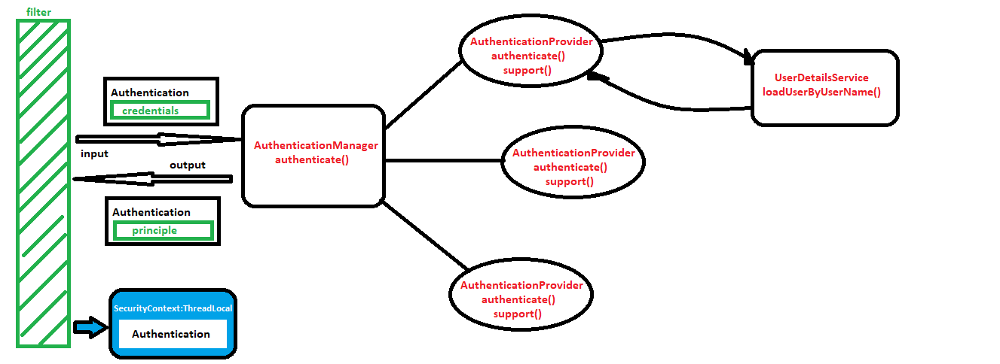

Spring security is offered by spring to avoid and prevent security vulnerabilities. They have 5 core principles :

1. Authentication
2. Authorization
3. Principle
4. Granted Authority
5. Roles
   1.Authentication (Who is logging in? the identity) is the process in which a user is allowed to enter an application. Every user would be having an id and some personal information he can give so that application recognizes that the right user has logged in and authenticates accordingly. This personal information could be a password the user had given during registeration, a pin number or personal questions. Some times a multi factor authentication can be used where a secret message is sent to the user who has access to device
   Example login: gmail login multifactor authentication, facebook etc
   2.Authorization (What the person trying to login wants to do what can he do? Does he have access?) is the process of giving or checking what can be given to the user by the application. For example in a google drive the native user can read write and modify the owned drive. But accessing others drive folder will need access from the owner for read write or modify. Also a host of meeting can record share screen in a meeting but the guest might not be able to do so.
   3.Priniple: once logged in the user is the principle logged in user and given all access he is allowed. The user does not have to login again and again and the application treats the logged user as a trusted one.
   Ex: once logged in at facebook u can use all features within your account
   4.Granted Authority: permission to access a service is given by application to the authenticated authorized person.(fine grained) there could be duplicated authority granted
   Ex: say all hr of a company should have granted authority to employee details so each time a hr joins the person is given authority to access these details
6. Roles: The access can be by default given to a group of members based on the role of the person by the application rather than one by one granting access( course grained)
   Ex: all employees can access the application, all hr can access employee details and manager can access employee details and assign them projects. So when the application sees hr as role the hr is given the access to employee db details.

Spring security offers security with the concept of servlet filters or interceptor. An url has to go through DelagatingFilterProxy before getting the service and only after it clears the filter its meant or allowed to enter in.
In springboot the configuration specific comes with security by default in Spring you will have to configure DelegatingFilterProxy as below:
<filter>
<filter-name> SpringFilterChain</filter-name>
<filter-class>org.springframework.web.filter.DelegatingFilterProxy</filter-class>
</filter>
<filter-mapping>
<filter-name> SpringFilterChain </filter-name>
<url-pattern>/\*<url-pattern> //include all urls
</filter-mapping>

Depending on the url being requested spring will delegate the url to respective filters( this can also be user configured but there are inbuilt internal filters even if the security is not configured.

Spring Authentication:
Spring Authentication takes an input(credentials) and outputs the principle(logged in user) The Authentication Object in spring is meant to hold credentials before Authentication and hold the principle after authentication.
Authentication commonly is done in Spring by Providers(AuthenticationProvider) authenticate () method.
There could be multiple AuthenticationProviders in an application supporting Database Store or Oauth or LDap or SSO. The AuthenticationManager actually checks which provider supports the credentials present using support method of providers and delegates to the respective provider.
Normally the AuthenticationProvider gets the credentials and the credentials are compared with the opens in store to check validity ,expiration, authority etc. Spring has come up with a solution to generalize this as it’s the same for all type of authentication i.e. using Userdetails interface.
The final Authentication object with Priniciple is sent back to filter and saved in present Thread Security Context.

Springboot starter dependency:
<dependency>
<groupId>org.springframework.boot</groupId>
<artifactId>spring-boot-starter-security</artifactId>
</dependency>

Configure application property for default authentication :
spring.security.user.name=test
spring.security.user.password=test

in memory authentication:
extend WebSecurityConfigurerAdapter and override configure(AUthenticationManagerBuilder) with AUthenticationManagerBuilder object

@EnableWebSecurity for enabling and

Use Password encoding for hashing passwords: @Bean of PasswordEncoder

To authorize the access we use configure(HttpSecurity http) and its authorizeRequests matched with url pattern to specific roles. /logout to logout from session.

LDAP: Lightweight Directory Access Protocol
Access and maintain directory or tree lie information and LDAP helps in authenticating and authorize this kind.
Configure ldap properties and ldap server with ldif files. Also authenticate using ldapauthenticate()

Jwt: JSONWebToken
It’s a generalized way for communication between 2 parties for a secure communications. open industry std:RFC 7519. Its widely sued for authorization.
Add jwt dependencies
Add jwt util to generate token
Add jwt controller to authenticate and check token in request

OAuth: Authorizing between service where a service is authorized by another service.(Delegated Access) using oAuth Access token in the format jwt
Example: google provided authorization to link various website to link with gmail account.

OAuth flows: ex: photo album website tries using google drive owned by user

1. Resource: the protected item to be accessed (photo)
2. Resource owner: owner of resource who has the access(user)
3. Resource server: where protected item exists (google drive)
4. Client: who wants or needs access to protected resource.who makes request to server on behalf of owner(photo album website)
5. Authorization server : issues tokens to client. Its resource server or who has the protected item’s responsibility to safeguard the resource. So the resource server is normally coupled by authorization server.

Oauth flow 1: Authorization Code Flow--- authorization server checks with resource owner and confirms if they wanted the client to access resource. Then after confirming with owner exchange auth token with client confirms and provides access token which provide further access to client and hence can communicate with resource server.
Oauth flow 2: Implicit Flow--- it’s the same as above but without the auth token and directly gives access token to the client.
Oauth flow 3: useful in microservices-Client credentials Flow – when client is very trustworthy eg: it’s a client or application you created the client--- difference service in bundle of microservice.

##jwt steps

> add spring secuirty, spring web, jjwt and jaxb dpeendencies(after java 9)
> create a @Service to get user or authenticate details
> create a jwtUtil class- given a username and password it generates a jwt key/token
> (Jwts.builder.setClaims(claims).set....signWith(algo,secretkey).compact())
> create a /authenticate mechanism where it will recieve the username and password and provide a jwt token only on valid username password as response
> intercept all incoming request: create filter to check token once:extends OncePerRequestFilter(there are other filters too)in doFilterInternal validate token in header with the jwtUtil validateToken method
> The generated jwttoken in response of /authenticate is supposed to be taken by client and send in header authorization with its requests to server
