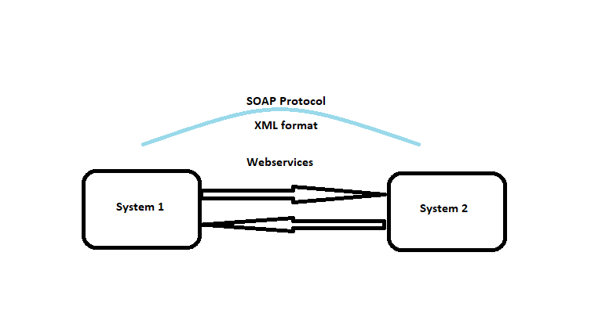

#API IS ANYTHING REUSABLE
#COULD BE ANYTHING A METHOD, JAR CLASS OR A SERVICE
#Web services could be thought of as a better alternative for jars with a w3c definition which
lets us consume it interoperably (platform independent)from machine to machine over a network without worrying on dependencies
IN JAVA
| -------------SOAP JAX-WS
Webservices----|
| -------------RESTJAX-RS
Webservices are a interoperable.
Hence when webservices are to be consumed by an application it needs to be generalized. So hence the xml version of contract to the webservice called the WSDL format which is understood by all languages irrespective of it being java, python or any.
WSDL consist of methods, arguments and return type. Direction to client app to use WSDL is done in UDDI (Universal Description Discovery and Integration) which is like a registry/directories of webservices place, where services are published. A webservice has to register it here and query to USSI will give them a WSDL.
SOAP: Simple Object Access Protocol

It’s a protocol (xml format) to encode and decode message within a network between services. in which sender and receiver sends data. sender and receiver could be written in different or same language.
Service Endpoint interface at client application that converts webservice call to a soap service. These SEI is language specific.Interface to the service endpoint

Consuming a webservice:
Do a wsimport and retirve stub classes to access methods. These ws import will generate custom datatypes as well( https://www.youtube.com/watch?v=KFlDdb65w3U&list=PLqq-6Pq4lTTZTYpk_1DOowOGWJMIH5T39&index=4 )
An @WebService annotation with @webmethods and other functionalities would create a soap web service in jax-ws. Conversion to xml can be done on pojo with @XmlRootElemnt and @Xmlelement and @XmlType
SOAP services are very specific, the protocols are tight and strict.

REST:
Rest on the other hand is an architectural style based on how web services has to be designed.
The Rest Specification was built on top of HTTP so most of the specifications are similar to it.
in Representation State Transfer where every component is a resource and resources are accessed by a common interface using HTTP standard methods. Its a web based standard architecture and uses HTTP protocol for communication. Every rest service should have a Resource based URI, HTTP methods, HTTP status codes and Message headers.
A Rest Server provides access to a resource and Rest Client accesses and presents the resources. Each resource is identified by URI/ global IDS.
Rest consists of uri very similar to HTTP urls. Good Rest API makes use of HTTP methods depending on needs (GET,POST, PUT,DELETE)
Metadata: HTTP status codes - 200(success) 500(server error) 404(not found)
Content Type: the resource representation, what content the message is in (text/xml, application/json). Helps the application geta headsup on how to parse the message.

Restful Resource Uri best practices :
• Should be unique and independent of technical details
• Should normally have only nouns (avoid verbs ex: messages instead of getmessages)
• Consider relationships between resources
Http Methods:
• different http methods use Same uri (GET,POST: add new resource, OUT: update resource by replacing old one with new one, DELETE)

> GET: request a response representation of the specified resource. it only retrieves data

> HEAD: Response is identical to GET but is asked without a response body

> POST: Used to submit entity to a specified resource. This often causes change in state or side effect on server.more like create

> PUT: replace all current representation of the target resource with request payload. more like update

> DELETE: deletes a sprcified resource

> OPTIONS: used to describe communication options for target resource

> PATCH: a partial modification to a resource is applied

• Differentiate the methods--- GET is said to be read only and put, post and delete write only. By default Get method is said to be repeatable and have no effects on the server. Put and delete also do not have effects on server even if its write since they put or update the same resource and end result is same. And deleting the same resource multiple time would mean its deleted the first time and later has no effect hence its safely repeatable (so GET,PUT and DELETE are idempotent). But now if we consider a POST it would lead to multiple duplicate entries in the server (its not idempotent). There is one more concept called the safe methods. All safe methods are idempotent but all idempoent are not safe(Put and Delete are not safe but are iudempotent) a method is safe if it does not alter the state of the server like GET,HEAD or OPTIONS
• Get method is a cacheable method
Rest response:
• Responses should consist of content type and status codes so that the client is aware of what response is coming towards them
The Richardson Maturity model to define rest APIs:
Level 0:single URI, swamp of POX(plain old xml), no http concepts are leveraged for communicationnot restful apis
Level 1: defined Resource uri only
Level 2: introduce http methods and status codes along with resources too
Level 3: applying HATEOAS where u can find various uri inside as a hypertext(refer javabrains)

@Path annotation with the resource url. @GET and @Post for http methods.@Produces (MediaType.TEXT_PLAIN) says what type of response to send and mediatype enumeration has the values.

This was on creation of soap and rest using JAX-WS and JAX-RS.
Let s explore creation of soap service using springboot:

1. Create a spring started with web services and dev tools
2. Add wsdl stub creating dependency entry in pom( wsdl4j for ex)
3. Create an xsd file as a contract WSDL
4. Create service class: lets process the request and do the business operations
5. Create endpoint class:write endpoint to expose
6. Create config class: port name, servlet details, which servlet is loaded,also @EnableWS here to enable webservices, provide config for registration servlet(MessageDispatcherServlet).
